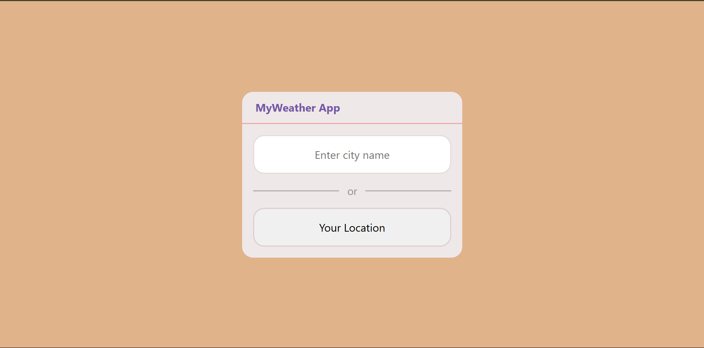
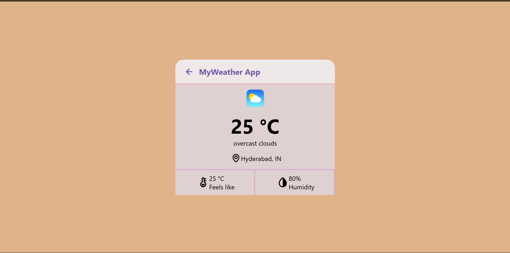
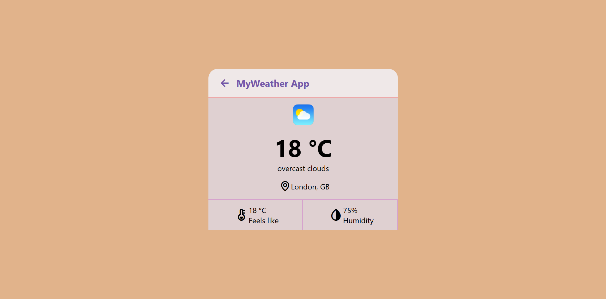

# 🌤️ Weather App

Hi Guys, here I made a simple web app to display the current weather using the OpenWeatherMap API. 
Built with HTML, CSS, and JavaScript.

Hope You Love it :)

---

## 🔧 Features

- Search weather by city name (or)
- Get weather using device location (Btw, This Feature will start working soon...)
- Shows temperature, condition, "feels like", and humidity
- Dynamic weather icons based on conditions

---

## 🖼️ Screenshots

| Project UI | Location-wise (Current - Hyderabad) |
|:---:|:---:|
|  |  |

| London Weather (Test) | The Hague Weather (Test) | Sydney Weather (Test) |
|:---:|:---:|:---:|
|  |  |  |

---

## 🚀 Usage

1. Open the app in a browser.
2. Type a city name and press **Enter**, or click **"Your Location"**.
3. View current weather details instantly.

---

## 🧠 How It Works

- JavaScript sends a request to the OpenWeatherMap API.
- The response contains real-time weather data.
- The page updates with temperature, condition, humidity, and location.

---

## 🔑 Setup

Replace the placeholder API key in `index.js` with your own:

``` js
appid=YOUR_API_KEY_HERE  
